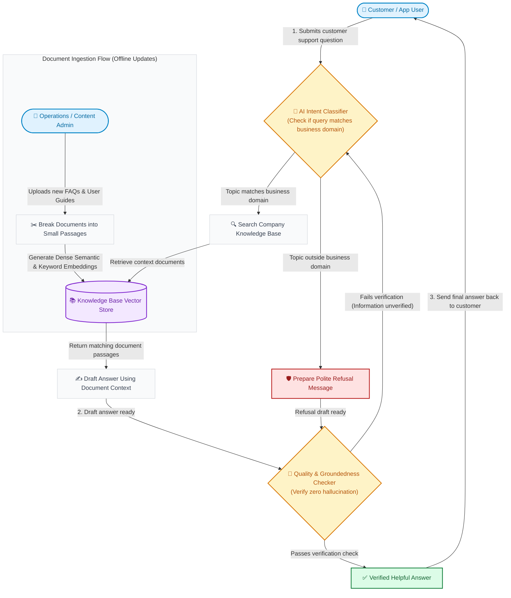
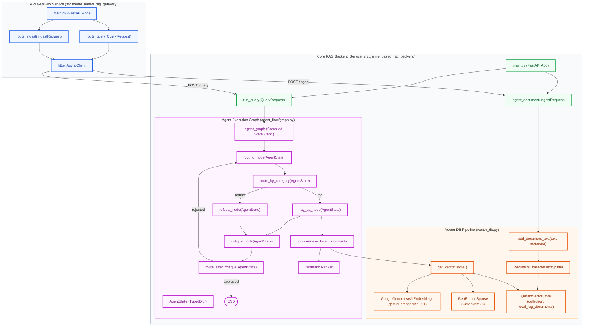
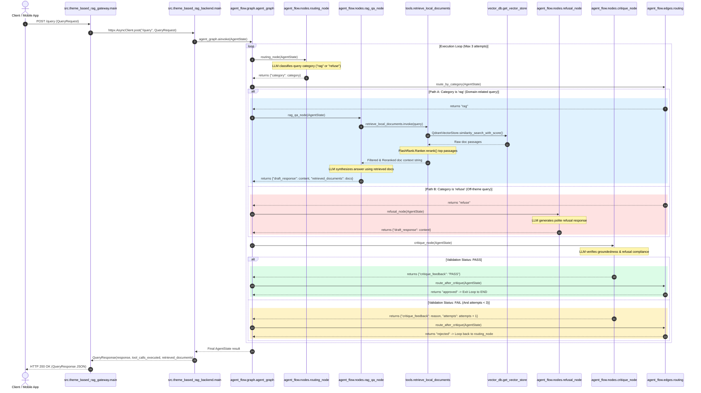

# Theme-Based RAG Workflow

A modular, stateless Retrieval-Augmented Generation (RAG) customer service chatbot utilizing the Google Gemini API, LangGraph agent orchestration, and Qdrant for document vector storage.

---

## 1. Executive Summary & Technology Stack

### Business Overview
The **Theme-Based RAG Workflow** is an enterprise-grade customer service chatbot system designed to deliver strictly grounded, accurate responses while preventing off-topic queries and AI hallucinations. 

- **Topic Boundaries**: Automatically enforces business domain boundaries (e.g., Fintech SaaS platform documentation) by routing off-theme queries to a dedicated refusal engine.
- **Self-Correcting Groundedness Verification**: Incorporates a self-critique agent loop that evaluates answer candidates against retrieved context before presenting them to customers.
- **Enterprise Ingestion Pipeline**: Ingests company documentation into a high-performance vector store with hybrid dense (semantic) and sparse (keyword) indexing.

### Technical Overview
Built on a microservice architecture separating an API Gateway proxy (`theme_based_rag_gateway`) from the core RAG execution engine (`theme_based_rag_backend`). The system utilizes LangGraph for state management, combining hybrid Qdrant search with FlashRank neural reranking for passage retrieval.

### Technology Stack & Dependencies

*  **Python 3.10+**: Core programming environment and runtime.
*  **FastAPI**: Asynchronous web framework used for the API Gateway and backend services.
*  **LangGraph**: Framework for orchestrating stateful, multi-node agent loops, conditional routing, and critique workflows.
*  **LangChain**: Framework for text chunking (`RecursiveCharacterTextSplitter`), document abstractions, and model integrations.
*  **Google Gemini API**: Powers LLM decision-making (`gemini-3.1-flash-lite`) and dense text embeddings (`gemini-embedding-001`).
*  **Qdrant Vector DB**: Vector store supporting hybrid dense-sparse retrieval and payload filtering.
*  **FastEmbed BM25**: Fast lexical embedding engine for sparse keyword matching (`Qdrant/bm25`).
*  **FlashRank**: Ultra-fast neural reranking model used to rerank retrieved document passages.
*  **Docker**: Containerization infrastructure for Qdrant and microservice deployment.
*  **Uvicorn**: Production-ready ASGI server implementation powering FastAPI endpoints.
*  **HTTPX**: Asynchronous HTTP client powering the gateway proxy routing layer.

---

## 2. Business Flow Overview

Below is a simplified operational workflow designed for business managers and product stakeholders, illustrating how customer queries and knowledge base updates move through the system without technical jargon:

---

## 3. Technical System Architecture

Below is a detailed component architecture diagram illustrating the internal modules, state graphs, data structures, and interactions between `theme_based_rag_gateway` and `theme_based_rag_backend`:

---

## 4. Technical Sequence & Business Logic Execution

Below is a sequence diagram detailing the end-to-end execution flow across exact class names, function calls, and data transitions, highlighting conditional logic branches with colorized alternative blocks:

