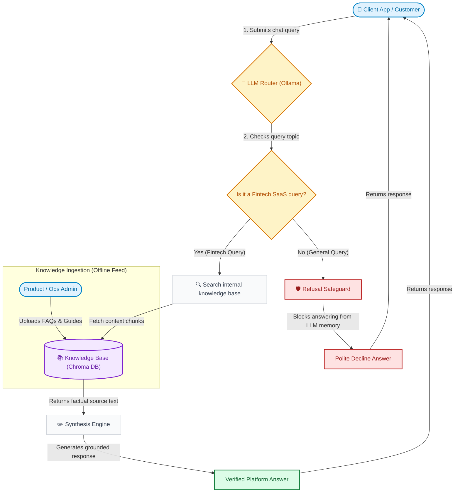
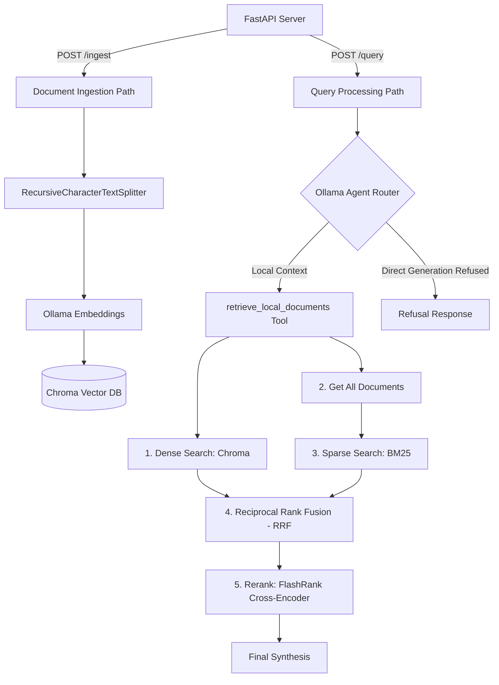
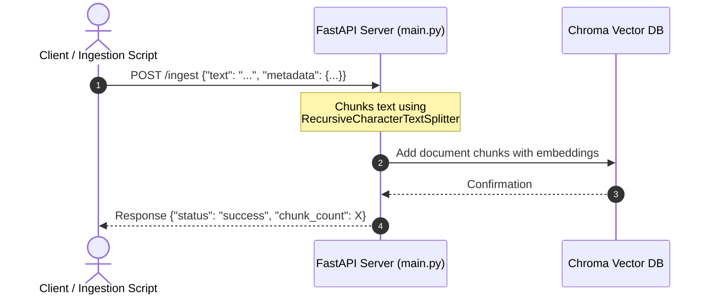
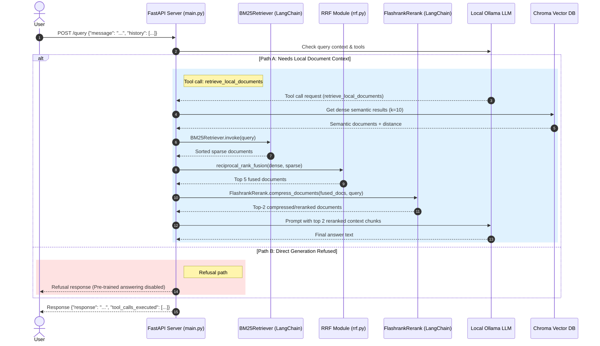

# Fintech RAG Chatbot

A modular, stateless local Retrieval-Augmented Generation (RAG) customer service chatbot for a Fintech SaaS platform utilizing a local Ollama instance and a Chroma Vector Database for local document storage.

## Business & Product Flow (Overview)

Below is a simplified view of how information flows through the Fintech RAG Chatbot system, designed for product managers and operations:

## Features & API Endpoints

The backend exposes two main HTTP POST endpoints under FastAPI:

- **`POST /ingest`**: Accepts raw text documents, splits them into manageable chunks, generates vector embeddings, and stores them in the local Chroma database.
- **`POST /query`**: Accepts user queries and history. An LLM agent routes queries to retrieve platform documentation from the local database. If a query does not trigger retrieval, the direct pathway is refused to ensure responses are fully grounded in the local database.

---

## Architecture & Logic Flow

Below is a high-level flowchart showing how ingestion and querying are routed through the FastAPI backend:

### 1. Ingestion Path

The ingestion pipeline converts plain text into queryable semantic chunks inside the Chroma Vector Database.

### 2. Query Path

When a query is received, the Ollama model is invoked with tool-calling capabilities. It dynamically decides whether it needs to query the local vector database for platform facts or answer directly.

